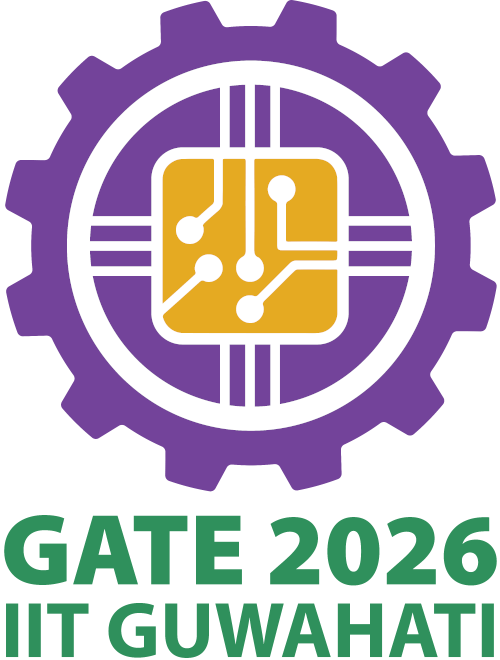

# 👋 Hi, I'm Ridham Patel

### AI/ML Researcher & GenAI Application Developer | NLP & Computer Vision | MLOps | AWS Certified Cloud Practitioner | GATE DA 2026 Qualified

*B.E. Information Technology @ LDRP Institute of Technology and Research, Gandhinagar*

## About Me

I'm an AI/ML Researcher and Generative AI Application Developer with hands-on experience spanning **Federated Learning**, **Computer Vision**, **Deepfake Detection**, **LLM Security**, and **Reinforcement Learning**.

My research is currently under peer review at **Springer's International Journal of Intelligent Transportation Systems Research**, and I hold an **Indian Patent** (filed) for an IoT-enabled computer vision system. On the engineering side, I specialize in fine-tuning and deploying open-source LLMs into production using Python, FastAPI, and MLOps tooling.

Currently exploring: LLM Security & Red Teaming, Agentic AI systems, and scalable MLOps pipelines.

## Technical Arsenal

  
   
  

**Generative AI & NLP:** LangChain · LangGraph · AutoGen · HuggingFace · OpenAI GPT · spaCy · NLTK · RAG Pipelines · Conversational AI

**ML / DL & Research:** PyTorch · TensorFlow · Scikit-learn · OpenCV · Federated Learning · Reinforcement Learning · Ensemble Methods

**MLOps & Cloud:** Docker · Kubernetes · CI/CD (GitHub Actions) · AWS · Prometheus · Grafana · ELK Stack

## Achievements & Recognition

### 🏆 Top 800 of 31,000+ | Meta × Scaler OpenEnv Hackathon 2026
**Incident Response Commander – AI Agent RL Environment** — Designed a novel RL research environment simulating SRE incident response across a 10-service microservice architecture. Benchmarked a Llama 3.1 8B baseline agent scoring 0.70/0.62/0.56 across Easy/Medium/Hard tasks.

### 🥈 Runner-Up | Odoo × GVP National Hackathon 2026
**Qubits Learnova – eLearning Platform** — Architected a modular Express.js + Prisma + PostgreSQL backend with 13 lesson types, RBAC, Razorpay integration, gamification, and AI quiz generation.

### 🏅 2x National Finalist | Smart India Hackathon (SIH) 2023 & 2024
**Deepfake Detection System** — Researched ensemble deep learning approaches (EfficientNet, InceptionNetV3, ViT) across 5 benchmark datasets totaling 82.6 GB for face-swap deepfake detection.

### 🥉 2nd Runner-Up | SSIP State Level Hackathon 2025
Ranked 3rd among numerous teams for developing impactful technical solutions under the SSIP initiative.

### 🏅 2x Finalist | Odoo National Hackathon 2025 (GVP & IITGN)
Recognized as a national finalist in both the March and June 2025 editions.

## Research & Publications

1. ***FED-DETR: Privacy-Preserving Intelligent Traffic Enforcement using Federated Learning***  
   International Journal of Intelligent Transportation Systems Research (Springer) | Under Peer Review  
   Developed a decentralized object detection pipeline using Federated Learning and DETR (Detection Transformer) for automated helmet detection in intelligent traffic monitoring.

2. ***Automated Waste Segregation Dustbin for Educational Institutions***  
   Indian Patent | Application No. 202521111515 | Under Review  
   Designed and prototyped an IoT-enabled smart dustbin with a lightweight computer vision model for real-time automated waste classification on edge devices.

## Certifications

<table align="center">
<tr align="center">
<td>

</td>
<td>

</td>
</tr>
<tr align="center">
<td>

**GATE DA 2026 Qualified**
</td>
<td>

**AWS Certified Cloud Practitioner**
</td>
</tr>
</table>

## Global Exposure

### 🌍 UK–France Future Leaders Program 2025
Selected for a competitive 1-month hybrid international immersion program — 6-day academic residency at the **University of Kent (London)** and 6-day business residency at **IESEG School of Management (Paris)**, covering Global Leadership, Cross-Cultural Collaboration, and International Business Strategy.

## Let's Connect!

I'm always open to research collaborations, interesting conversations, and new challenges — whether it's federated learning, LLM security, MLOps, or anything in between.

 

